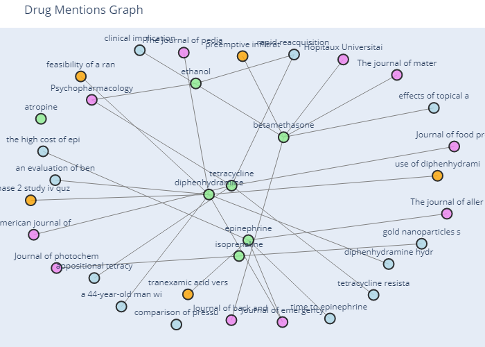
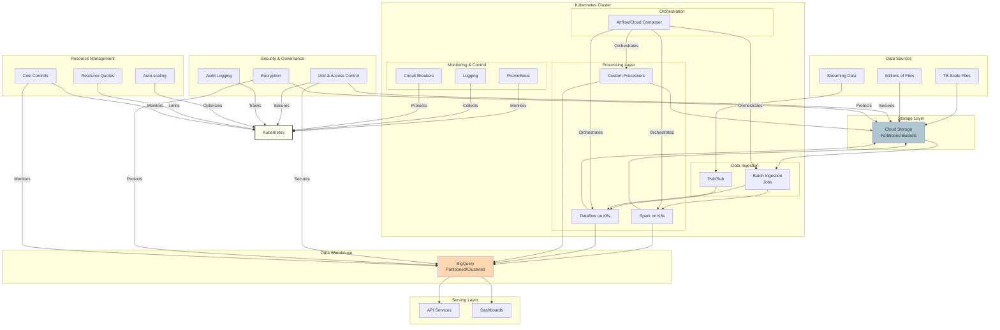

# Pharmaceutical Data Pipeline

[](https://github.com/psf/black)
[]()
[](https://pycqa.github.io/isort/)

This project is a data pipeline for processing pharmaceutical data and generating a drug mention graph. It is designed to facilitate analysis of drug mentions across various scientific publications and clinical trials.

## Project Structure

The project is organized into the following directories and files:

```
mle_test/
├── data/
│   ├── input/
│   └── output/
├── main.py
├── src/
│   ├── __init__.py
│   ├── ad_hoc/
│   │   ├── __init__.py
│   │   ├── analysis.py
│   │   └── graphs.py
│   ├── models/
│   │   ├── __init__.py
│   │   └── schemas.py
│   ├── pipeline/
│   │   ├── __init__.py
│   │   ├── extractors.py
│   │   └── transformers.py
│   ├── sql_test/
│   │   ├── __init__.py
│   │   ├── create_tables/
│   │   │   ├── product_nomenclature.sql
│   │   │   └── transactions.sql
│   │   ├── dblite.py
│   │   ├── local_db/
│   │   ├── queries/
│   │   │   ├── client_sales_query.sql
│   │   │   └── revenue_query_with_alias.sql
│   │   └── synthetic_data.py
│   └── utils/
│       ├── __init__.py
│       ├── helpers.py
│       └── project_tree.py
└── tests/
    ├── __init__.py
    ├── data/
    ├── local_db/
    ├── test_graph_comparison.py
    ├── test_integration.py
    └── test_sql.py
```

This structure organizes the project into logical components, facilitating easy navigation and management of the codebase. Each directory serves a specific purpose, such as storing input data, source code, or test cases. The `src` directory contains the main application logic, while the `tests` directory includes unit and integration tests to ensure code quality and functionality.

## Setup

### Docker

To run the project in a Dockerized container, follow these steps:

1. Build the Docker image:
    ```bash
    make build
    ```

2. Run the Docker container (you'll get an interactive shell):
    ```bash
    make run
    ```

    You can run the pipeline with
    ```bash
    python main.py
    ```

    The adhoc treatment can be found in:

    ```bash
    python -m src.ad_hoc.analysis
    ```

    And the SQL queries with
    ```bash
    python -m src.sql_test.dblite
    ```

3. Execute tests inside the Docker container:
    ```bash
    make test
    ```

### Virtual Environment

If you are on Windows, you can use:

```bash
.\ws_install_venv.ps1 -envName mle_test
```

### Dependency Management

This project uses `uv` for dependency management to avoid conflicts.


#### Install uv

To install uv locally, run:

```bash
make install_uv
```

#### Create and Activate Virtual Environment

Once installed, activate your virtual environment:

```bash
make venv
make activate
```

#### Install Dependencies

If setting up the project for the first time, install dependencies with:

```bash
make install
```

## Pre-commit

To automatically apply coding best practices, install pre-commit with:

```bash
make pre_commit
```

## Tests

This module is tested with `unittest`. To run the tests, use:

```bash
make test
```

## Documentation

### Generate Documentation

TODO: Code is commented and ready for automatic documentation generation.

### View Documentation

To better understand the code by consulting the module documentation, visit TODO (sphynx).

## Analysis Capabilities

The pharmaceutical data pipeline includes analysis capabilities for understanding drug-journal relationships. The following analyses are performed:

1. **Journals with Most Mentions of a Specific Drug**:
   - Identifies which journals mention a specific drug the most times.
   - Helps in understanding the prominence of a drug in scientific literature.

2. **Journal with Most Different Drug Mentions**:
   - Determines which journal mentions the highest number of different drugs.
   - Provides insights into journals that cover a wide range of pharmaceutical topics.

3. **Graph Visualization**:
   - Interactive network visualization showing relationships between drugs and journals.
   - Provides a quick and intuitive way to grasp the connections in the database.
   - The graph is available in `graph.html` at the `./data/charts`.

   > **Note**: To view the interactive visualization:
   > 1. Clone the repository locally
   > 2. Open `graph.html` in your web browser
   >
   > Screenshot of the visualization:
   >
   > 

   This interactive visualization allows users to:
   - Zoom in/out to explore different parts of the network
   - Hover over nodes to see detailed information

The results of these analyses are logged using the `loguru` logger, providing clear and concise output for further investigation or reporting.

## Pipeline Design Considerations

The pipeline is structured to facilitate easy implementation with Airflow. Key design considerations include:

1. **Modular Task Functions**:
   - Each step in the pipeline is encapsulated in a separate function, representing a distinct task.
   - This modularity allows each function to be easily mapped to an Airflow task, promoting reusability and clarity.

2. **Clear Task Dependencies**:
   - The pipeline tasks are executed in a logical sequence, forming a directed acyclic graph (DAG).
   - This structure aligns with Airflow's DAG-based execution model, making it straightforward to define task dependencies.

3. **Configurable and Flexible**:
   - The pipeline supports configuration through a dictionary, allowing for easy customization of file paths and parameters.
   - This flexibility is crucial for adapting the pipeline to different environments and datasets.

4. **Robust Logging and Error Handling**:
   - The use of `loguru` for logging provides detailed execution information, essential for monitoring and debugging in Airflow.
   - Comprehensive error handling ensures that failures are logged and can be addressed promptly.

These design choices ensure that the pipeline is not only effective for processing pharmaceutical data but also ready for integration into a production-grade workflow management system like Airflow.

## Going Forward

### Key Considerations for Handling Large Data Volumes (TB Scale or Millions of Files)

#### Container Orchestration
- **Kubernetes Deployment**: Implement Kubernetes for orchestrating multi-node processing of TB-scale data.
- **Stateful Workloads**: Use StatefulSets for maintaining processing state across millions of files.
- **Resource Management**: Configure resource quotas and limits for predictable performance.

#### Data Storage and Access
- **Use Cloud Storage**: Store large datasets in Google Cloud Storage for scalability.
- **Optimize Data Formats**: Implement Parquet or Avro formats that support compression and efficient querying.
- **Data Locality**: Configure storage and compute proximity to minimize data transfer costs.

#### Data Processing
- **Distributed Processing**: Leverage Apache Beam with Dataflow or Spark with Dataproc on Kubernetes.
- **Batch Processing**: For large historical datasets with checkpointing for recovery.
- **Stream Processing**: For real-time data ingestion with proper backpressure handling.

#### Data Ingestion
- **Pub/Sub for Streaming**: Handle high-throughput real-time data.
- **Batch Ingestion**: Use scheduled jobs for large files with parallel workers.
- **Failure Recovery**: Implement idempotent processing to handle retries.

#### Data Transformation and ETL
- **Pipeline Modularity**: Scale using Apache Airflow on Kubernetes.
- **Parallel Processing**: Implement with dynamic resource allocation.
- **Data Partitioning**: Process data in right-sized chunks to optimize memory usage.

#### Data Validation and Quality
- **Automated Validation**: Enhance checks for data quality with sampling techniques.
- **Error Handling**: Implement robust logging and troubleshooting.
- **Circuit Breakers**: Prevent cascade failures when processing millions of files.

#### Scalability and Performance
- **Horizontal Scaling**: Configure Kubernetes node pools optimized for data processing.
- **Optimized Queries**: Use BigQuery with partitioning and clustering.
- **Preemptible Instances**: Reduce costs for fault-tolerant batch workloads.

### Recommended Modifications
- Adapt code for Kubernetes-native execution with proper resource requests.
- Implement data warehousing with BigQuery for TB-scale analytics.
- Refactor ETL processes for Dataflow with parallelization patterns.
- Orchestrate with Cloud Composer (Airflow) on Kubernetes.
- Set up comprehensive monitoring, and security (access and encryption).

> **Note**: The viability of Kubernetes must be studied, considering the cost and the volume to treat. Cloud Run can be a solution most of the time.

### Future Work


